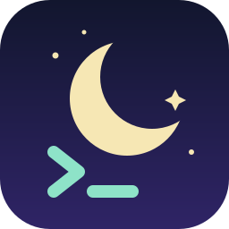
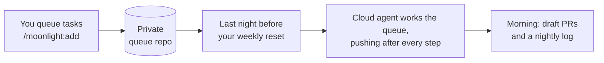

<p align="center">
  
</p>

<h1 align="center">Moonlight</h1>

<p align="center">
  <strong>Give your leftover AI usage a night job.</strong>
</p>

<p align="center">
  
  
  
</p>

Your weekly usage limit resets on a fixed day, and whatever you haven't used is gone. Moonlight spends it on your backlog: on the last night before your reset, a cloud agent works through your task queue while you sleep and leaves draft pull requests for the morning.

## How it works



A typical week, with a Thursday 09:00 reset and sleep from 23:00 to 07:00:

| When | What happens |
|---|---|
| Wed 23:00 | First run: finishes anything left half-done, then takes new tasks |
| Thu 04:15 | Second run, on a fresh 5-hour usage window |
| Thu 07:00 | Work is pushed, the log is written, runs stop |
| Thu 09:00 | Your weekly limit resets with nothing wasted |

Runs happen in the cloud, so your computer can be off.

## Install

```
/plugin marketplace add atty57/moonlight
/plugin install moonlight@moonlight
/reload-plugins
```

Then run `/moonlight:setup`. It asks four questions (which repos, when you sleep, whether usage credits are off, whether to show usage in your status line) and does the rest:

1. Reads your weekly reset time from your status line's usage data, or asks you.
2. Plans the runs inside your sleep window on the last night before the reset.
3. Creates a private queue repo, `<you>/moonlight-queue`.
4. Schedules the runs as cloud routines.

## Queue work

```
/moonlight:add add retries to the webhook sender in acme/api
```

Moonlight turns the request into a task with a checkable finish line and adds it to `QUEUE.md` in your queue repo:

```markdown
## MOON-7: Add retries to the webhook sender
- status: todo
- repo: acme/api
- goal: Retry failed webhook deliveries up to 3 times with exponential backoff.
- done when: `pytest tests/webhooks` passes, including a new retry test.
```

You can also edit `QUEUE.md` directly on GitHub, even from your phone. A task with `repo: none` is a writing or research job, and its result lands as a Markdown file in the queue repo's `outputs/` folder.

Each task moves from `todo` to `wip` to `pr <link>` (or `done <file>`). If a task needs you, it becomes `blocked — <question>`; answer in its notes and set it back to `todo`.

| Command | What it does |
|---|---|
| `/moonlight:setup` | First-time setup, or change repos, sleep hours and schedule |
| `/moonlight:add <task>` | Queue a task |
| `/moonlight:status` | Next run, weekly usage, queue progress, blocked questions, last run |
| `/moonlight:uninstall` | Switch the routines off and restore your status line |

**Test it any day:** open the Moonlight routine, choose **Run now** and enter `force`. It works the queue for up to 2 hours.

## Safety

- **Turn off usage credits (extra usage) in your plan's usage settings.** With them on, a run that uses up your limit keeps going on paid overage.
- Moonlight works on its own branches and only opens draft pull requests; it never merges. For a hard guarantee, protect your default branches on GitHub, since routines can't push to protected branches.
- No connectors are attached, so a run can reach only git and the cloud environment's default network allowlist.
- Every run is an ordinary session you can open and read afterwards.
- Cloud routines are still a research preview, so check the nightly log after the first night.

## Requirements

- A Pro, Max, Team or Enterprise plan with cloud routines.
- A GitHub account with cloud access to your repos (run `/web-setup` once).
- git. The GitHub CLI (`gh`) is optional; with it, setup creates the queue repo for you.
- For automatic reset detection: a Pro or Max plan, on macOS, Linux, or Windows with Git Bash. Otherwise you type your reset time once.

## FAQ

**What if I've already used everything?** The run hits the limit and stops. Nothing is charged unless usage credits are on.

**Why only the last night?** Earlier in the week you still need your usage yourself. By the last night, anything left is about to expire.

**Can it touch my main branch?** It's instructed not to, and it only opens draft PRs. Branch protection makes that a hard rule.

**Is it only for code?** No. `repo: none` tasks cover research, writing and planning, and more kinds of output are on the roadmap.

## Under the hood

- The routine prompt, [`routine-prompt.md`](skills/setup/templates/routine-prompt.md), is the same for everyone. Your settings live in `moonlight.json` in your queue repo.
- Each run checks the clock against its stop time and exits unless it's the last night. It resumes unfinished work, then takes tasks top to bottom, pushing after every step so a usage limit never loses work.
- The status line script saves only the rate-limit numbers, then hands off to your existing status line if you have one.

## Roadmap

- Local mode for work that needs your GPU or local files
- More non-code outputs: docs, spreadsheets, email drafts
- Queue tasks from your phone or chat, not just the CLI
- Extra runs in weeks when usage is well under the limit

## License

MIT © 2026 Atharva Vichare
